# What's a graph?

## A structure with Nodes and Edges

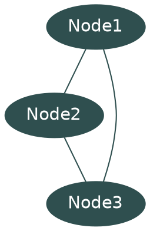

# What properties can they have?

## Sometimes they're directed

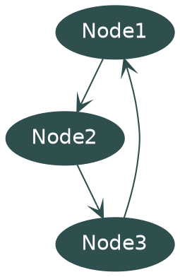

## Sometimes they're acyclic

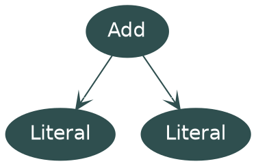

## Sometimes they store data

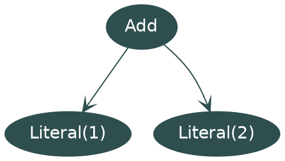

## Sometimes they store a lot of data

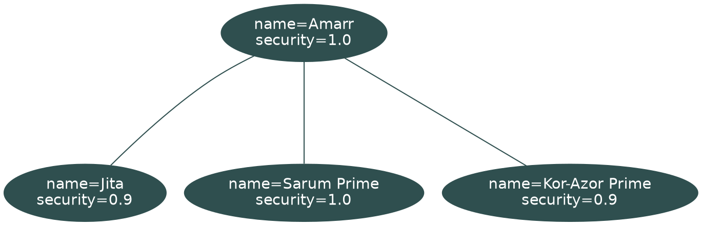

## Sometimes they have subgraphs

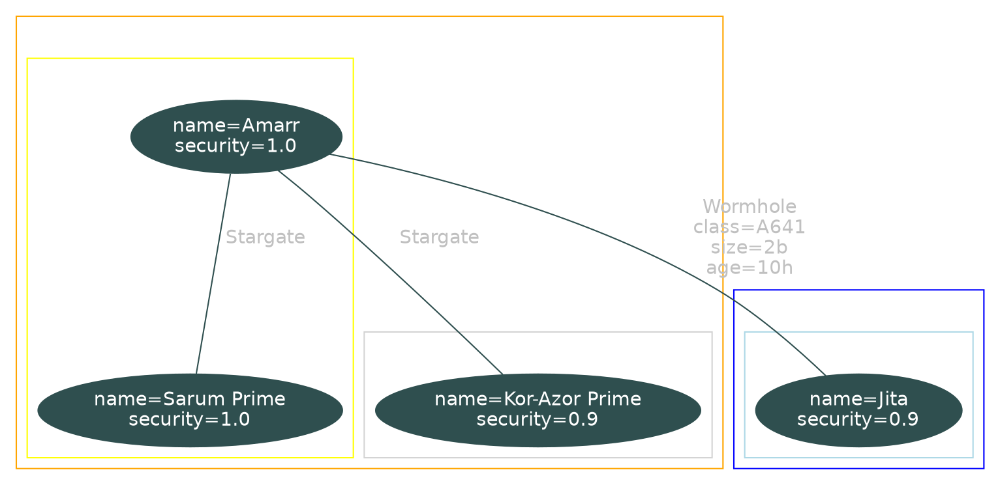


# Wait what's a tree then?

## A tree is:

* Directed
* Acyclic
* Each node has 0 or 1 parents

## This is not a tree

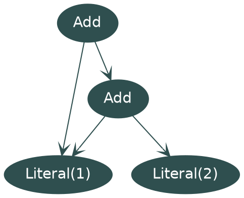

## But we can turn it into a tree by duplicating

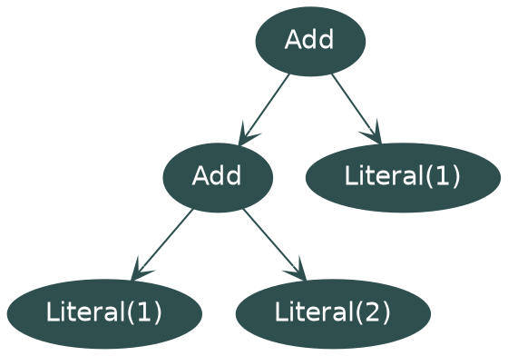

# Introducing Hedgehogs

* Purely FP Open source Graph library
* Cats-based
* Cross-built for Scala 2 and 3
* Cross-built for JVM/JS (and Native in a branch)

## Core Types - SimpleGraph

```scala
trait SimpleGraph[Id] {
  // data
  def nodes: Set[Id]
  def edges: Set[(Id, Id)]

  // graph operations
  def outgoing(id: Id): Set[Id]
  def inbound(id: Id): Set[Id]

  def reverse: SimpleGraph[Id] // reverses all edges

  // modifiers
  def addNode(id: Id): SimpleGraph[Id]
  def removeNode(id: Id): SimpleGraph[Id]
  def addEdge(from: Id, to: Id): SimpleGraph[Id]
  def removeEdge(from: Id, to: Id): SimpleGraph[Id]

  ...
}
```

## Core Types - DataGraph

```scala
trait DataGraph[Id, NodeData, EdgeData] extends SimpleGraph[Id] { self =>
  // data
  def nodeMap: Map[Id, NodeData]
  def edgeMap: Map[(Id, Id), EdgeData]

  // extra graph operations
  def outgoingEdges(id: Id): Map[Id, EdgeData]
  def incomingEdges(id: Id): Map[Id, EdgeData]

  // extra modify operations
  def addNode(id: Id, data: NodeData): DataGraph[Id, NodeData, EdgeData]
  def addEdge(from: Id, to: Id, data: EdgeData): DataGraph[Id, NodeData, EdgeData]

  ...
}
```

## Included Core Algorithms

* `Dijkstra` - routefinding
* `Connectivity` - check how many unconnected subgraphs exist
* `Dag` - check if a graph is a dag

### Dijkstra Example

```scala
scala> Dijkstra(
    DataGraph.empty[String, String, Int]
      .addNode("a", "")
      .addNode("b", "")
      .addNode("c", "")
      .addNode("d", "")
      .addEdge("a", "b", 1)
      .addEdge("b", "c", 2)
      .addEdge("c", "d", 1)
      .addEdge("a", "c", 2)
  )("a", "d")
res1: Option[(Int, List[String])] = Some(value = (3, List("a", "c", "d")))
```

### Dijkstra Demo

[scala.js demo](https://andimiller.net/hedgehogs-demo-2/)

## Modules - Mermaid

```scala
scala> Mermaid.flowchart(
    DataGraph.empty[String, String, Int]
      .addNode("A", "Node A")
      .addNode("B", "Node B")
      .addNode("C", "Node C")
      .addEdge("A", "B", 1)
      .addEdge("B", "C", 2)
  )(
    extractNodeId = identity,
    extractEdgeName = _.toString.some,
    extractNodeName = _.some
  )()
res1: String = """flowchart TD
  A["Node A"]
  B["Node B"]
  C["Node C"]
  A -->|1| B
  B -->|2| C
"""
```

###

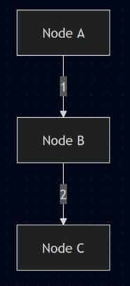

# So what did I need all this for?

::: notes

So what did I need all of this for?

:::


# EVE Online


::: notes

(pause) EVE Online is a 20 year old space themed MMO

:::

## Map

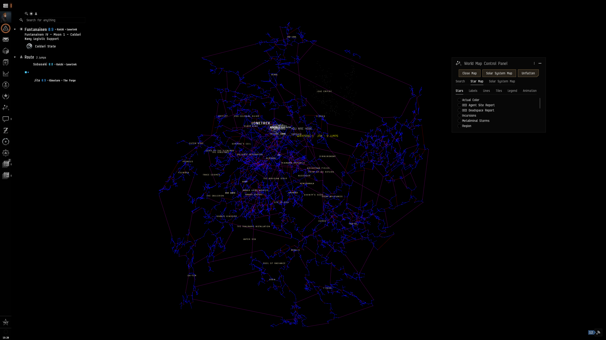

::: notes

It's got a pretty large star map with almost 8000 solar systems

:::

## Route Map

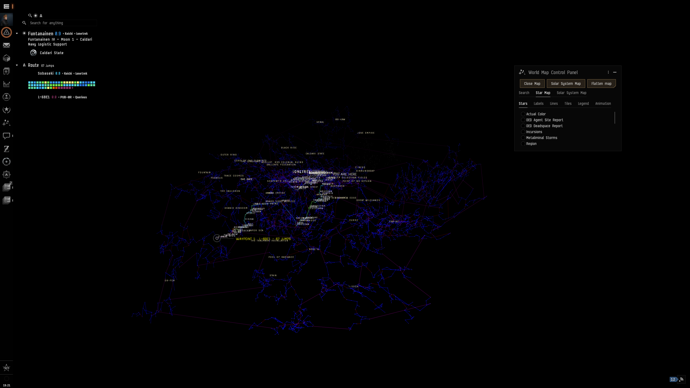

::: notes

These solar systems are connected by stargates, and the ingame map can do some basic routefinding, but, that's not good enough for a player base famous for loving spreadsheets...

:::

## Third party tooling

* EVE has APIs for players to use
* Originally SOAP, moved to OpenAPI
* Includes map data, and where characters and assets are

###

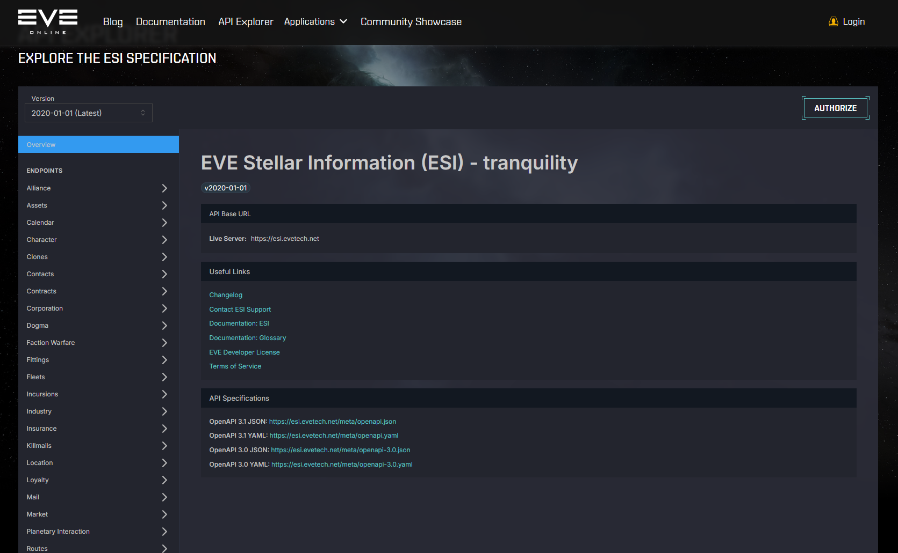

## Siggy

* Tool for keeping track of Wormholes, dynamically connecting systems
* 10+ years old
* Written in PHP and C#
* I had to port it to linux

###

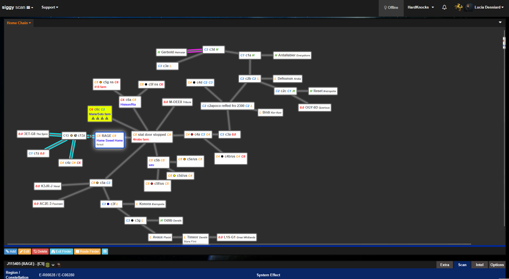

###

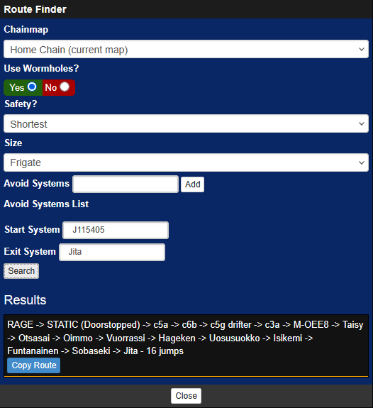

::: notes

So obviously I'd rather not write dijkstra in PHP, so this hooks back into a scala service, passing the dynamic list of systems and overlaying it with the static systems

:::

## ZKillboard

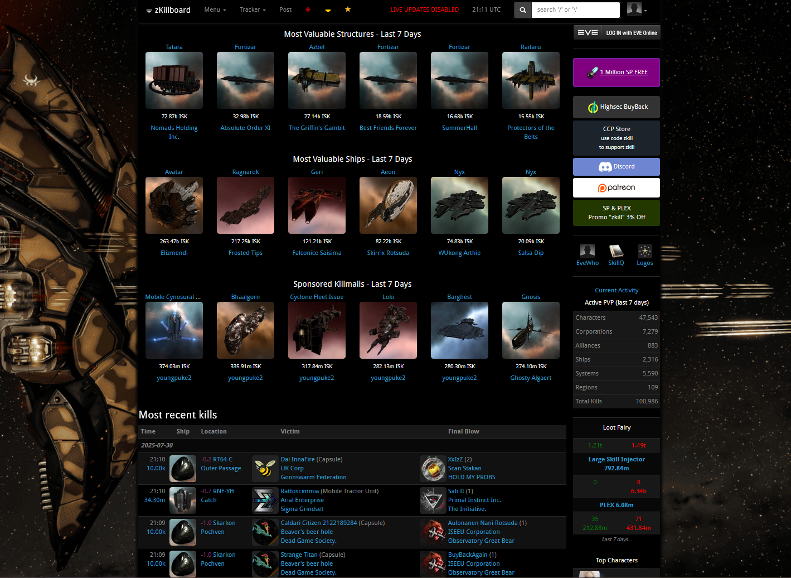

::: notes

We've got some big community-run websites that store killmails, pvp kills essentially, and it has a public feed of them as they happen, so...

:::

# killmail-router

* Monitor PVP activity from zkillboard live
* Pull which solar systems are connected to our home on siggy
* Check the activity is within 10 jumps, report if it is

[killmail-router](https://github.com/andimiller/killmail-router)

::: notes

I've got a discord bot written in scala which monitors that feed, checks which systems my corporation is connected to and feeds back on pvp activity happening nearby

:::

###

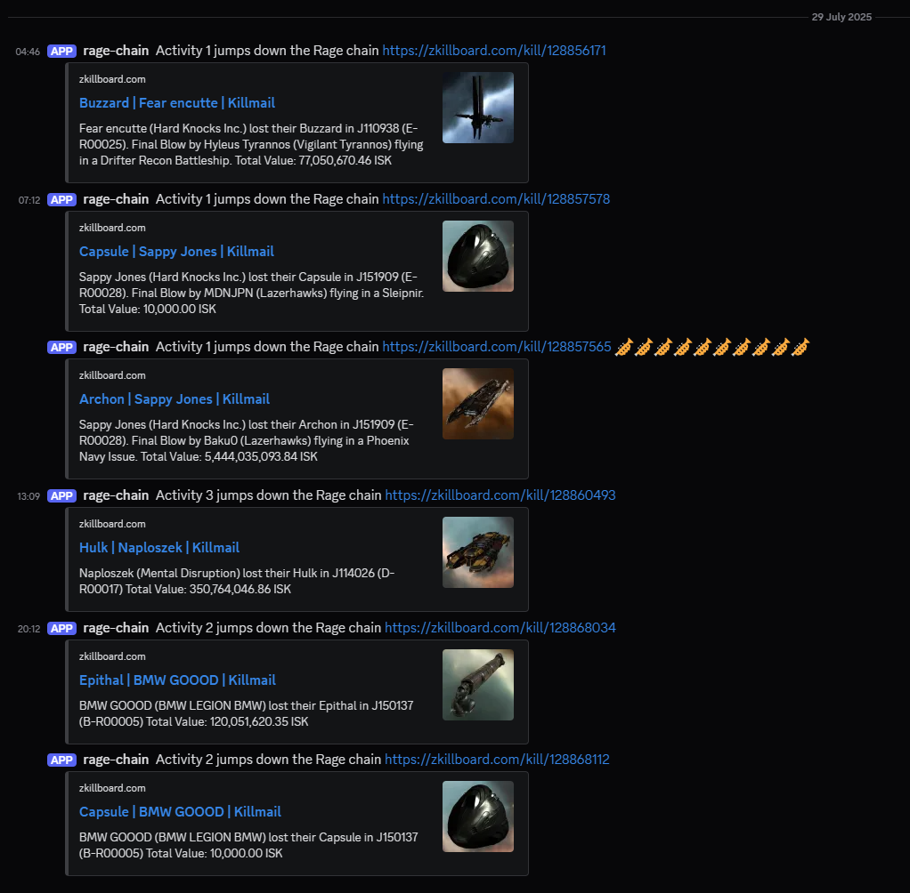

###

```yaml
routes:
- name: rage-chain
  filter: |-
    (and
      (not (== root.chain_distance.31002238 null))
      (not (<= root.chain_distance.31002238 10))
      (not (== root.killmail.wormhole_class 7))
    )
  webhook: https://discord.com/api/webhooks/redacted
  template: |-
    Activity ${root.chain_distance.31002238} jumps down the Rage chain https://zkillboard.com/kill/${root.killID} ${root.trumpets}
- name: my-corp
  filter: |-
    (let
      [
        (my-corp (== root.corporation_id 123456))
      ]
      (or
        (apply root.killmail.victim my-corp)
        (exists root.killmail.attackers my-corp)
      )
    )
  webhook: https://discord.com/api/webhooks/redacted
```


::: notes

here's an example of a config, you can see some lisp there checking the distance which has been hydrated into the objects, and another quick example of forwarding any kills related to a specific corporation

:::

# But what if we wanted to execute a graph...

## Revisiting Visitors

::: notes

You've probably seen them before, the common way of executing a tree would be a visitor, so let's go through them

:::

### OOP Style Visitor

```scala
trait Visitor[A] {
  def visit(a: A): Unit
}
```

::: notes

Here's a normal OOP style visitor, you implement this trait, when it visits a thing you do an effect, simple enough

:::

### FP Style Visitor

```scala
trait Visitor[F[_], A] {
  def visit(a: A): F[Unit]
}
```

::: notes 

We can make it a bit more FP by using an IO monad, now our effects are explicit, but they're still just doing some kind of side-effect, and our graphs are immutable...

:::


### So let's add traverse to our Graph types

```scala
trait DataGraph[Id, NodeData, EdgeData] extends SimpleGraph[Id] { self =>
  // for simple graphs
  def traverse[F[_]: Applicative, Id2](
      f: Id => F[Id2]
  ): F[DataGraph[Id2, NodeData, EdgeData]]
  // for data graphs
  def traverseNode[F[_]: Applicative, NodeData2](
      f: (Id, NodeData) => F[NodeData2]
  ): F[DataGraph[Id, NodeData2, EdgeData]]
}
```

::: notes

So let's add traverse to our graph types, we can do a traverse over the ids for a simple graph, and traverse the nodes on a data graph, letting us transform the data in the nodes

:::

### Module - dag-visitor

```scala
trait DagVisitor[F[_], Id, InputData, OutputData, EdgeData] {
  def run(
      id: Id,
      node: InputData,
      graph: DataGraph[Id, Either[InputData, OutputData], EdgeData],
      inputs: Map[(Id, EdgeData), OutputData]
  ): F[OutputData]
}
```

::: notes

This lets me run effects across a graph, this method's called for each node we run, it's run when all of the dependencies have finished running, and is passed dependencies in the `inputs` Map

And we can even go one better, we can make it run in parallel

:::

### Visitor Demo

[scala.js demo](https://andimiller.net/hedgehogs-demo/)

# Graphs and LLMs

## Why are they a good fit?

* Context
* Context
* Context

::: notes

We can resolve up to N nearby nodes and provide them as context to the LLM, this is graph based RAG

:::

# Any Questions?
