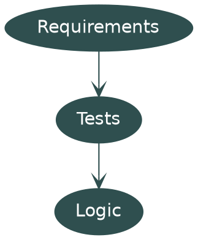
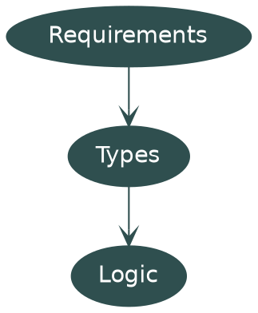
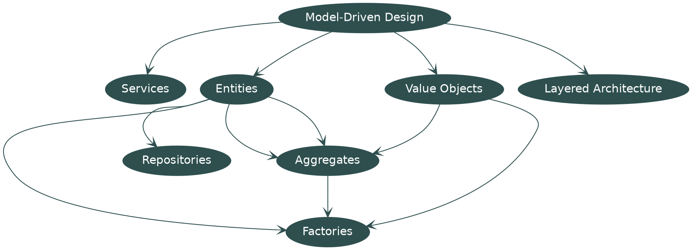
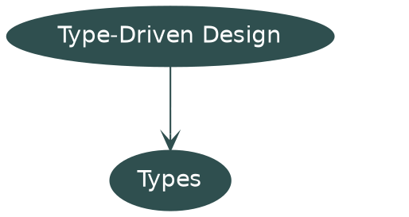
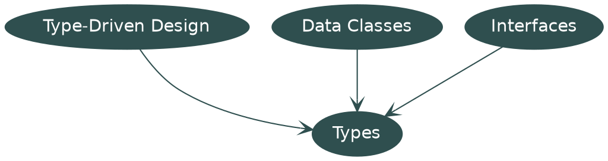
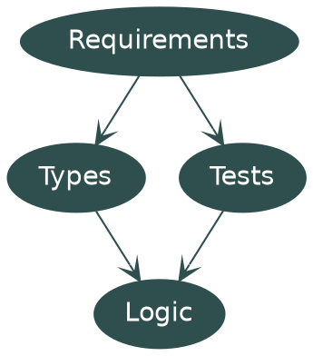

## What's Test Driven Development?



::: notes

So, to start off with a point of comparison you're all probably familar with, Test-Driven Development, what is it?

Well we take some requirements, turn them into tests, then we use those tests to validate the logic we write.

:::

### What's Type Driven Development?



::: notes

To hop over to Type-Driven Development, we're in stead translating our requirements into types, then coding against those types.

:::

### What's the process?
Type-Driven Development with Idris defines TDD as:

1. Write a type
2. Create the skeleton definition
3. Match on the input
4. Fill in the definition

::: notes

Type-Driven Development with Idris gives this definition, we define the type, we put a skeleton definition in, we match on the input, then we fill in the definition.

You can note that steps 3 and 4 here are optional, we could leave our implementations undefined and go around creating our types.

:::


## Hold on what do we mean by types?

Abstract Data Types.

B. Liskov and S. Zilles, “Programming with abstract data types,” Proceedings of the ACM SIGPLAN symposium on Very high level languages -, 1974.


::: notes

Alright, let's back up a bit, what do we mean by types? what do types mean in modern programming languages?

Well, the most important paper I'll point you to is this one, the 1974 paper by Liskov and Zilles introducing Abstract Data Types.

:::


### Abstract Data Types

They introduce a programming language which allows the programmer to define their own abstractions.

"An abstract data type defines a class of abstract objects which is completely characterized by the operations available on those objects."

::: notes

So what's the summary on that paper, they introduce the concept of a high-level programming language that allows the programmer to introduce their own abstractions.

In the paper it says an abstract data type is a class of abstract objects that are defined by the operations you can perform on them.

:::

### An OO Abstract Data Type

```java
public interface Counter {
    void add(int i);
    int get();
}
```

::: notes

So, to use something simple, here's an Abstract Data Type in Java, I've modelled something called a Counter, and it's behaviour is that you can make one, you can add an integer to it, and you can get the current integer value.

:::

### A Functional Abstract Data Type

```hs
newtype Counter = Counter Int

get :: Counter -> Int
add :: Counter -> Int -> Counter
```

::: notes 

Alright, what does this look like in a functional language? it's pretty much the same

Here's the same Counter in haskell, you'll see it's just defined as wrapping an integer, there's my get and there's my add

Counter's immutable here so add will return a new copy of Counter, but we're still basically doing the same exercise of encapsulation we were doing over in Java.

:::

## Domain-Driven Design (DDD)

::: notes

So you may be thinking to yourself, hold on, this is starting to sound a lot like something I heard of before called Domain-Driven Design, and you'd be correct, there's some overlap here

:::

### What's Domain-Driven Design?



::: notes

You'll see here we've got services, entities, value objects, aggregates, factories, this is all too much, nobody wants to deal with this

:::

### What can we keep?



::: notes

This, I don't want to prescribe anything more than that, just express your domain with types, they're methods and interfaces

:::

### If you really want some patterns



::: notes

If you really want some design patterns, here are two, types can contain data, and interfaces can represent things you can interact with, that should be enough to model your domain

:::


## Bringing it back to practicality

::: notes

Alright, so we know that types let us do some encapsulation, and this is about modelling our domain, what are some tips for doing it right?

:::

### Tip 1: Multiple constructors are bad actually

Any instance of a class should be valid, constructors should ensure they are valid.

::: notes

First up, multiple constructors are bad actually, I recommend each class has one constructor, and that constructor does validation of the input, we're all about encapsulation, and I want to know that any instance of a class is valid.

:::

### Tip 1: Implementation

```java
class NonEmptyString {
  String contents;
  public NonEmptyString(String s) throws IllegalArgumentException {
    if (s.isEmpty())
      throw new IllegalArgumentException("String was empty");
    else contents = s;
  }
}
```

::: notes


Here's one way to do that in java, you might hate it but this will ensure you can't get invalid instances of the NonEmptyString class

Give it a think, how would you ensure that only valid instances of a class get created in your language of choice?

:::

### Tip 2: Model with Data Classes and Interfaces

1. What does my data look like?
2. What are my operations?

::: notes

So, returning to the theme from the past section, see if you can model your entire domain using just Data Classes and Interfaces, I think that's possible, Barbara Liskov thought that was possible in the 70s, give it a go

:::

### Tip 3: If your type system isn't good enough, write tests!



::: notes

And tip 3, if your type system isn't good enough, write some tests!

I'm not here to tell you not to write tests, if you don't feel your type system can cover some edge cases, write those tests, you can look at this as a way of augmenting test-driven development.

:::

### Tip 4: Consider augmenting tests with property testing

JSON Encoding Law
```scala
forAll { input =>             // for all valid input
  val json = input.toJson     // turning it into JSON
  val output = json.as[Input] // decoding that JSON
  input == output             // should return the original input
}
```

::: notes

And to follow up on tip 3, consider property testing, it's commonly used in haskell to fill gaps where the type system can't

Here's one I commonly use in scala to sanity test my JSON encoders and decoders

Given any valid input, turning it into JSON, then decoding that JSON should give us the original input

Our test framework will try to break that, and if I've messed up somewhere it'll probably find it

:::

## Questions?

::: notes

And that's our whole journey through type-driven development, any questions?

:::
